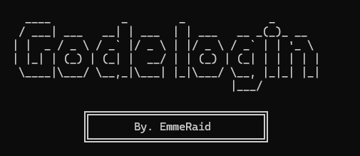

# GestionaleBase



**GestionaleBase** è un'applicazione console scritta in C# che consente la gestione di una lista di utenti.  
Permette di aggiungere, modificare, eliminare e visualizzare utenti, con la possibilità di salvare e caricare i dati da un file JSON.

---

## ✨ Caratteristiche principali

- ➕ Aggiunta di nuovi utenti con ID, nome ed email.
- ✏️ Modifica e eliminazione di utenti esistenti.
- 📋 Visualizzazione della lista utenti in formato tabellare.
- 💾 Salvataggio e caricamento dei dati da un file JSON (`saves/Salvati.json`).

---

## 🛠️ Installazione

1. Clona il repository:

   ```bash
   git clone https://github.com/EmmeRaid/GestionaleBase.git
